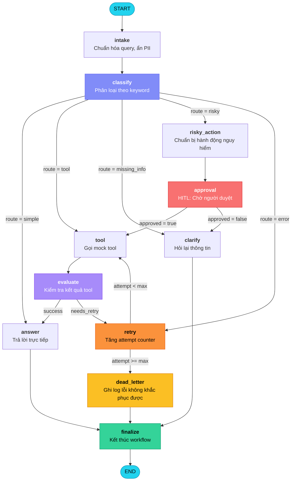
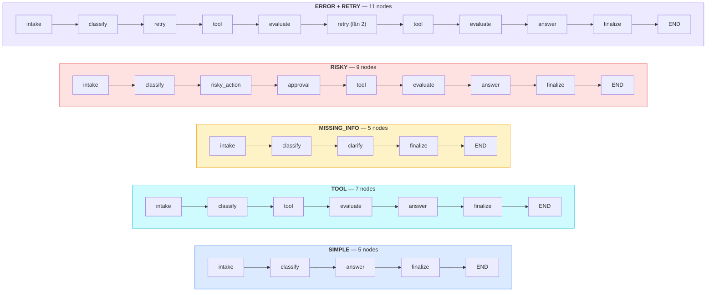
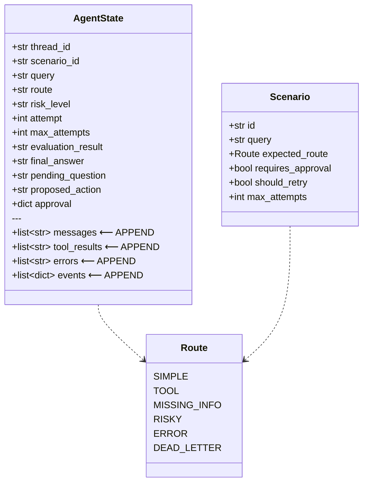
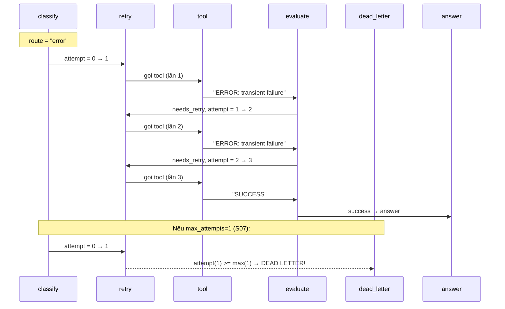

# Hướng Dẫn Demo — LangGraph Agent Lab

> **Sinh viên**: Võ Thành Danh — 2A202600503
> **Bài Lab**: Day 08 — Agentic Orchestration với LangGraph
> **Ngày**: 2026-05-11

---

## Mục Lục

1. [Tổng quan dự án](#1-tổng-quan-dự-án)
2. [Sơ đồ kiến trúc Agent](#2-sơ-đồ-kiến-trúc-agent)
3. [Giải thích chi tiết từng thành phần](#3-giải-thích-chi-tiết-từng-thành-phần)
4. [Bộ 15 kịch bản test](#4-bộ-15-kịch-bản-test)
5. [Các quyết định thiết kế quan trọng](#5-các-quyết-định-thiết-kế-quan-trọng)
6. [Lệnh chạy demo](#6-lệnh-chạy-demo)
7. [Kết quả đạt được](#7-kết-quả-đạt-được)

---

## 1. Tổng Quan Dự Án

Dự án xây dựng một **agent hỗ trợ khách hàng** sử dụng **LangGraph** — framework cho phép xây dựng workflow AI dạng đồ thị có trạng thái (stateful graph).

**Agent nhận một câu hỏi** (ví dụ: "Hoàn tiền cho khách hàng", "Tra cứu đơn hàng") rồi:

1. **Phân loại** câu hỏi vào 1 trong 5 tuyến (route) bằng keyword heuristics
2. **Định tuyến** đến node xử lý phù hợp (gọi tool, xin phê duyệt, hỏi lại thông tin...)
3. **Retry có giới hạn** — tối đa 3 lần thử, nếu hết thì chuyển dead-letter
4. **Yêu cầu người duyệt** (HITL) cho các hành động nguy hiểm
5. **Lưu trạng thái** qua SQLite checkpoint — chống crash

### Tại sao dùng LangGraph thay vì chain thông thường?

| Tính năng | Chain thường (LCEL) | LangGraph |
|---|---|---|
| Rẽ nhánh có điều kiện | Hạn chế | `add_conditional_edges()` |
| Vòng lặp retry | Không thể | `evaluate → retry → tool` cycle |
| Lưu trạng thái | Không | MemorySaver, SQLite, Postgres |
| Người duyệt (HITL) | Không | `interrupt()` tạm dừng chờ người |
| Time Travel | Không | `get_state_history()` xem lại trạng thái cũ |

---

## 2. Sơ Đồ Kiến Trúc Agent

### 2.1 Workflow tổng thể



### 2.2 Năm tuyến xử lý (5 Routes)



### 2.3 Sơ đồ State Schema



### 2.4 Luồng Retry với Dead Letter



---

## 3. Giải Thích Chi Tiết Từng Thành Phần

### 3.1 State Schema — Trạng thái chia sẻ giữa các node

📁 **File**: `src/langgraph_agent_lab/state.py`

**Nguyên lý**: Mỗi node đọc state, xử lý, trả về dict cập nhật. LangGraph merge kết quả vào state chung.

**Append-only reducer** — dòng 75-78: các field `messages`, `tool_results`, `errors`, `events` dùng `Annotated[list, add]` nghĩa là mỗi node **thêm vào** danh sách, không bao giờ ghi đè → giữ toàn bộ lịch sử audit.

```python
# state.py dòng 74-78
# --- Audit trail (append-only via `add` reducer) ---
messages: Annotated[list[str], add]
tool_results: Annotated[list[str], add]
errors: Annotated[list[str], add]
events: Annotated[list[dict[str, Any]], add]
```

**Overwrite fields** — dòng 56-72: các field như `route`, `attempt`, `final_answer` chỉ lấy giá trị mới nhất vì chỉ cần biết trạng thái hiện tại để định tuyến.

```python
# state.py dòng 61-66
# --- Routing & control (overwrite) ---
route: str
risk_level: str
attempt: int
max_attempts: int
evaluation_result: str | None
```

**Khởi tạo state** — dòng 98-117: hàm `initial_state()` tạo state ban đầu cho mỗi scenario, gán `thread_id` duy nhất để checkpoint.

---

### 3.2 Classify Node — Phân loại câu hỏi theo keyword

📁 **File**: `src/langgraph_agent_lab/nodes.py`, dòng 39-77

**Nguyên lý**: Dùng **priority-ordered keyword matching** (không cần LLM). Thứ tự ưu tiên từ cao đến thấp:

```python
# nodes.py dòng 16-19
RISKY_KEYWORDS = {"refund", "delete", "send", "cancel", "remove", "revoke"}
TOOL_KEYWORDS = {"status", "order", "lookup", "check", "track", "find", "search"}
VAGUE_PRONOUNS = {"it", "this", "that"}
ERROR_KEYWORDS = {"timeout", "fail", "failure", "error", "crash", "unavailable"}
```

**Logic phân loại** — dòng 54-69:

```python
# nodes.py dòng 54-69
# Priority 1: Risky actions (highest priority)
if any(kw in clean for kw in RISKY_KEYWORDS):
    route = Route.RISKY
    risk_level = "high"
# Priority 2: Tool usage
elif any(kw in clean for kw in TOOL_KEYWORDS):
    route = Route.TOOL
# Priority 3: Missing information (vague short queries)
elif len(clean) < 5 and any(p in clean for p in VAGUE_PRONOUNS):
    route = Route.MISSING_INFO
# Priority 4: Error/failure detection
elif any(kw in clean for kw in ERROR_KEYWORDS):
    route = Route.ERROR
# Priority 5: Simple (default)
```

**Tại sao RISKY ưu tiên cao nhất?** Câu "Delete and check order status" chứa cả keyword RISKY ("delete") và TOOL ("check", "status"). Priority đảm bảo an toàn — hành động nguy hiểm luôn phải qua bước duyệt.

---

### 3.3 Routing — Rẽ nhánh có điều kiện

📁 **File**: `src/langgraph_agent_lab/routing.py`

**4 hàm routing** điều khiển luồng đi của graph:

**route_after_classify** (dòng 12-26) — map route → node tiếp theo:
```python
# routing.py dòng 19-26
mapping = {
    Route.SIMPLE.value: "answer",
    Route.TOOL.value: "tool",
    Route.MISSING_INFO.value: "clarify",
    Route.RISKY.value: "risky_action",
    Route.ERROR.value: "retry",
}
return mapping.get(route, "answer")  # default an toàn
```

**route_after_retry** (dòng 29-37) — quyết định retry hay dead-letter:
```python
# routing.py dòng 35-37
if int(state.get("attempt", 0)) >= int(state.get("max_attempts", 3)):
    return "dead_letter"  # Hết quota → ghi log lỗi
return "tool"             # Còn quota → thử lại
```

**route_after_evaluate** (dòng 40-48) — kiểm tra kết quả tool:
```python
# routing.py dòng 46-48
if state.get("evaluation_result") == "needs_retry":
    return "retry"   # Tool lỗi → thử lại
return "answer"      # Tool OK → trả lời
```

**route_after_approval** (dòng 51-58) — xử lý phê duyệt:
```python
# routing.py dòng 57-58
approval = state.get("approval") or {}
return "tool" if approval.get("approved") else "clarify"
```

---

### 3.4 Graph Assembly — Lắp ráp đồ thị

📁 **File**: `src/langgraph_agent_lab/graph.py`, dòng 38-90

Đây là nơi **kết nối tất cả node và routing** thành một StateGraph hoàn chỉnh:

```python
# graph.py dòng 48-88 (rút gọn)
graph = StateGraph(AgentState)

# Đăng ký 11 nodes
graph.add_node("intake", intake_node)
graph.add_node("classify", classify_node)
graph.add_node("answer", answer_node)
graph.add_node("tool", tool_node)
graph.add_node("evaluate", evaluate_node)
graph.add_node("clarify", ask_clarification_node)
graph.add_node("risky_action", risky_action_node)
graph.add_node("approval", approval_node)
graph.add_node("retry", retry_or_fallback_node)
graph.add_node("dead_letter", dead_letter_node)
graph.add_node("finalize", finalize_node)

# Nối các cạnh
graph.add_edge(START, "intake")
graph.add_edge("intake", "classify")
graph.add_conditional_edges("classify", route_after_classify)  # Rẽ nhánh 5 đường
graph.add_edge("tool", "evaluate")
graph.add_conditional_edges("evaluate", route_after_evaluate)  # success hoặc retry
graph.add_edge("risky_action", "approval")
graph.add_conditional_edges("approval", route_after_approval)  # approved hoặc reject
graph.add_conditional_edges("retry", route_after_retry)        # tool hoặc dead_letter

# Tất cả đường đều kết thúc tại finalize → END
graph.add_edge("answer", "finalize")
graph.add_edge("clarify", "finalize")
graph.add_edge("dead_letter", "finalize")
graph.add_edge("finalize", END)
```

---

### 3.5 Approval Node — Human-in-the-Loop

📁 **File**: `src/langgraph_agent_lab/nodes.py`, dòng 141-174

Hỗ trợ **2 chế độ**:

```python
# nodes.py dòng 148-168
if os.getenv("LANGGRAPH_INTERRUPT", "").lower() == "true":
    # Chế độ Production: tạm dừng graph, chờ người duyệt
    from langgraph.types import interrupt
    value = interrupt({
        "proposed_action": state.get("proposed_action"),
        "risk_level": state.get("risk_level"),
    })
else:
    # Chế độ Test/CI: tự động phê duyệt (mock)
    decision = ApprovalDecision(
        approved=True,
        reviewer="mock-reviewer",
        comment=f"Auto-approved for scenario {state.get('scenario_id')}",
    )
```

---

### 3.6 Persistence — Lưu trạng thái chống crash

📁 **File**: `src/langgraph_agent_lab/persistence.py`, dòng 15-56

Ba backend checkpointer:

```python
# persistence.py dòng 24-26: Memory (mặc định)
if kind == "memory":
    from langgraph.checkpoint.memory import MemorySaver
    return MemorySaver()

# persistence.py dòng 28-45: SQLite với WAL mode
if kind == "sqlite":
    conn = sqlite3.connect(db_path, check_same_thread=False)
    conn.execute("PRAGMA journal_mode=WAL")  # Write-Ahead Log cho đọc song song
    return SqliteSaver(conn=conn)
```

**Crash-resume demo** trong `web.py` dòng 209-246: Chạy scenario → hủy graph instance → tạo graph MỚI từ cùng DB → khôi phục state thành công.

---

### 3.7 Tool Node — Mô phỏng gọi API

📁 **File**: `src/langgraph_agent_lab/nodes.py`, dòng 99-120

```python
# nodes.py dòng 109-114
# Mô phỏng lỗi tạm thời cho error-route
if route == Route.ERROR.value and attempt < 2:
    result = f"ERROR: transient failure on attempt {attempt}"
else:
    result = f"tool-result: Successfully processed request..."
```

**Logic**: Error-route scenarios sẽ lỗi ở attempt 0 và 1, thành công ở attempt 2 → kiểm chứng vòng retry.

---

### 3.8 Metrics & Auto-Report

📁 **File**: `src/langgraph_agent_lab/metrics.py`, dòng 37-59

Hàm `metric_from_state()` trích xuất metrics từ state cuối:

```python
# metrics.py dòng 43-47
retry_count = sum(1 for node in nodes if node == "retry")
interrupt_count = sum(1 for node in nodes if node == "approval")
success = actual_route == expected_route and bool(state.get("final_answer"))
if approval_required:
    success = success and approval is not None
```

📁 **File**: `src/langgraph_agent_lab/report.py` — Mỗi lần chạy `run-scenarios`, report tự động điền data thật vào `reports/lab_report.md`. Không cần sửa thủ công.

---

### 3.9 Web Dashboard

📁 **File**: `src/langgraph_agent_lab/web.py` — FastAPI server với 8 endpoint

| Endpoint | Chức năng |
|---|---|
| `GET /` | Trang dashboard HTML |
| `GET /api/scenarios` | Danh sách 15 kịch bản |
| `POST /api/run` | Chạy 1 scenario (có trigger HITL modal) |
| `POST /api/resume` | Tiếp tục graph sau khi user click Approve/Reject |
| `POST /api/run-all` | Chạy tất cả 15 scenario (bypass HITL để lấy metrics) |
| `GET /api/metrics` | Lấy metrics.json mới nhất |
| `GET /api/state-history/{id}` | Lịch sử state (time travel) |
| `GET /api/graph-diagram` | Mermaid diagram dạng Top-Down |
| `POST /api/crash-resume` | Demo crash-resume SQLite |

📁 **File**: `static/index.html` — 6 panel giao diện dark-mode

📁 **File**: `static/style.css` — Glassmorphism CSS, backdrop-filter, micro-animations

📁 **File**: `static/app.js` — Chart.js (biểu đồ), Mermaid.js (sơ đồ), flow animation

---

## 4. Bộ 15 Kịch Bản Test

📁 **File**: `data/sample/scenarios.jsonl`

| ID | Câu hỏi | Route | Đặc biệt |
|---|---|---|---|
| S01_simple | How do I reset my password? | simple | FAQ cơ bản |
| S02_tool | Please lookup order status for 12345 | tool | Gọi tool tra cứu |
| S03_missing | Can you fix it? | missing_info | Câu hỏi mơ hồ ("it") |
| S04_risky | Refund this customer and send confirmation | risky | Cần HITL approval |
| S05_error | Timeout failure while processing | error | 3 lần retry rồi thành công |
| S06_delete | Delete customer account | risky | Hành động phá hủy |
| S07_dead_letter | System failure cannot recover | error | max_attempts=1 → dead letter |
| S08_cancel | Cancel my subscription immediately | risky | Hủy dịch vụ |
| S09_track | Track my shipment #789 | tool | Theo dõi vận chuyển |
| S10_vague | Help me with this | missing_info | Cực kỳ mơ hồ |
| S11_crash | Application crash on startup | error | 2 lần retry rồi thành công |
| S12_remove | Remove my payment method | risky | Xóa phương thức thanh toán |
| S13_faq | What are your business hours? | simple | FAQ |
| S14_search | Search for product availability | tool | Tìm kiếm sản phẩm |
| S15_revoke | Revoke API access for user admin | risky | Thu hồi quyền truy cập |

**Kết quả: 15/15 pass (100%)**

---

## 5. Các Quyết Định Thiết Kế Quan Trọng

### 5.1 Tại sao dùng `Annotated[list, add]`?

📁 Evidence: `state.py` dòng 74-78

Khi node trả `{"messages": ["new msg"]}`, LangGraph **thêm** vào list thay vì ghi đè → giữ toàn bộ audit trail qua mọi node.

### 5.2 Tại sao mọi đường đều kết thúc ở `finalize → END`?

📁 Evidence: `graph.py` dòng 85-88

Ngăn graph bị treo (deadlock). Dù đi route nào, cuối cùng đều về `finalize`.

### 5.3 Tại sao RISKY ưu tiên cao nhất?

📁 Evidence: `nodes.py` dòng 54-57

An toàn trước hiệu năng. Câu hỏi có cả keyword RISKY và TOOL → luôn đi qua bước approval.

### 5.4 Tại sao dùng SQLite WAL mode?

📁 Evidence: `persistence.py` dòng 40-41

WAL (Write-Ahead Log) cho phép đọc song song không block ghi → phù hợp cho web dashboard đọc state trong khi agent đang chạy.

---

## 6. Lệnh Chạy Demo

### Cài đặt

```powershell
cd "d:\Vinuniversity\Full 15 slide\Track 3-AI aplication\Day 8\phase2-track3-day8-langgraph-agent"
pip install -e ".[dev]"
```

### Chạy test (55 tests)

```powershell
pytest -v
```

### Chạy tất cả 15 scenarios + tự động tạo report

```powershell
python -m langgraph_agent_lab.cli run-scenarios --config configs/lab.yaml --output outputs/metrics.json
```

### Kiểm tra metrics hợp lệ (cho chấm điểm)

```powershell
python -m langgraph_agent_lab.cli validate-metrics --metrics outputs/metrics.json
```

### Kiểm tra code style

```powershell
ruff check src tests
```

### Khởi chạy Dashboard web

```powershell
uvicorn langgraph_agent_lab.web:app --host 0.0.0.0 --port 8000
```

Mở trình duyệt tại **http://localhost:8000**

### Script demo nhanh (chạy tất cả)

```powershell
pip install -e ".[dev]"
pytest -v
ruff check src tests
python -m langgraph_agent_lab.cli run-scenarios --config configs/lab.yaml --output outputs/metrics.json
python -m langgraph_agent_lab.cli validate-metrics --metrics outputs/metrics.json
uvicorn langgraph_agent_lab.web:app --host 0.0.0.0 --port 8000
```

### Demo Time Travel
1. Chạy 1 scenario bất kỳ.
2. Nhìn sang panel **State Inspector / Time Travel**.
3. Click vào từng bước (Step 0, Step 1...) để xem toàn bộ JSON payload của state tại thời điểm đó trong quá khứ.

### Demo HITL (Human-in-the-Loop) UI
1. Chọn scenario **S04_risky** hoặc **S06_delete** từ dropdown.
2. Click **Run**.
3. Agent sẽ chạy đến node `approval`, hệ thống sẽ tạm dừng (interrupt) và bật **Modal Yêu Cầu Phê Duyệt (Approve/Reject)**.
4. Click **Approve Action**, agent tiếp tục chạy `tool` → `evaluate` → `answer` → thành công.

### Demo Crash Recovery
1. Cuộn xuống cuối trang.
2. Click **Test Crash → Resume**.
3. Hệ thống sẽ tạo 1 database SQLite (WAL), chạy dở dang, giả lập tiến trình bị kill, tạo 1 tiến trình mới trỏ vào cùng DB đó và khôi phục (resume) state thành công.

---

## 7. Kết Quả Đạt Được

| Hạng mục | Kết quả |
|---|---|
| Tests | **55 passed**, 1 skipped |
| Lint | **0 errors** |
| Scenarios | **15/15 (100%)** |
| Total retries | 6 (qua 3 error scenarios) |
| HITL approvals | 5 (qua 5 risky scenarios) |
| Avg nodes/scenario | 6.7 |

### Đối chiếu Rubric

| Tiêu chí | Yêu cầu | Đạt |
|---|---|---|
| State Schema | TypedDict + reducers | Yes — `state.py` |
| Node Logic | Classify + route + tool + evaluate | Yes — `nodes.py` (9 nodes) |
| Graph Routing | Conditional edges + all paths terminate | Yes — `graph.py` + `routing.py` |
| Retry Loop | Bounded + dead letter | Yes — max 3 attempts |
| HITL | Approval node + interrupt support | Yes — mock + real interrupt |
| Persistence | Checkpointer + crash resume | Yes — memory + SQLite WAL |
| Metrics | JSON schema cho grading | Yes — `outputs/metrics.json` |
| Scenarios | Tối thiểu 6 | 15 scenarios (bonus) |
| Report | Tự động từ data thật | Yes — `report.py` |
| **Bonus**: Dashboard | Web UI chuyên nghiệp | Yes — FastAPI + Vanilla JS |
| **Bonus**: Mermaid diagram | Export graph | Yes — `outputs/graph.mermaid` |
| **Bonus**: Extended scenarios | Thêm edge-case | 8 scenarios thêm |
