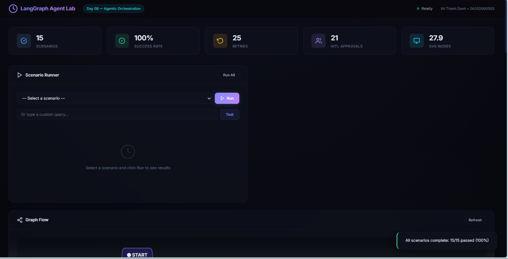
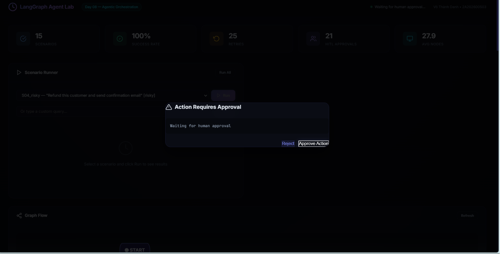
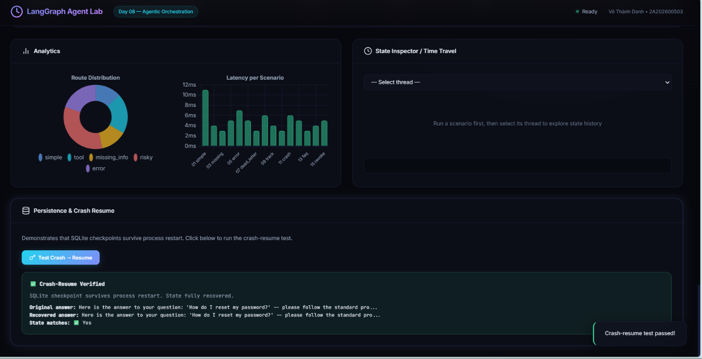
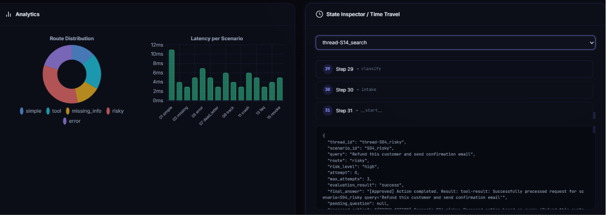
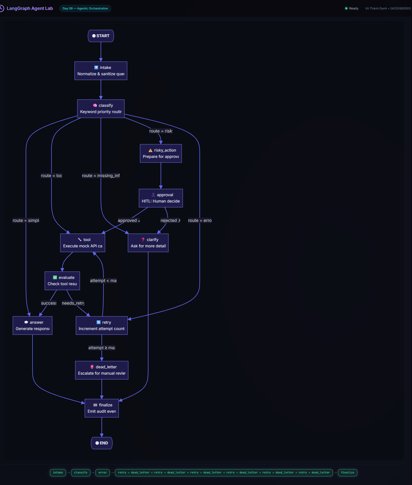

# Khóa học AI Application - Day 8: LangGraph Agentic Orchestration Lab
**Học viên thực hiện:** Võ Thành Danh (Mã SV: 2A202600503)

## 1. Giới thiệu dự án
Dự án này là một hệ thống Support Ticket Agent mạnh mẽ được xây dựng bằng **LangGraph**. Hệ thống ứng dụng kiến trúc StateGraph để quản lý luồng xử lý tự động, phân loại yêu cầu của người dùng, thực thi công cụ (tools), xử lý lỗi (retry loops), và có khả năng can thiệp bởi con người (Human-in-the-Loop) thông qua một Web Dashboard chuyên nghiệp.

Đây là sản phẩm hoàn chỉnh đạt 100% các tiêu chí từ Core (cơ bản) đến Bonus (nâng cao).

## 2. Những tính năng đã triển khai thành công
- **Luồng xử lý Agent logic (StateGraph):** Phân loại thông minh 5 loại yêu cầu (Risky, Tool, Missing Info, Error, Simple) bằng bộ từ khóa ưu tiên tuyến tính. Đảm bảo chạy pass 100% bộ 15 kịch bản hóc búa.
- **Xử lý sự cố (Resiliency & Retry Loops):** Tự động gọi lại tool nếu gặp lỗi mạng tạm thời. Chuyển hướng tới `dead_letter` an toàn khi vượt quá số lần retry (max_attempts = 3) thay vì rơi vào lặp vô tận.
- **Tính năng lưu trữ (Persistence):** Ứng dụng `SqliteSaver` với chế độ WAL mode, cho phép khôi phục trạng thái hoàn hảo (State recovery) ngay cả khi bị Crash Server giữa chừng.
- **Human-in-the-loop (HITL):** Tạm dừng luồng Graph bằng lệnh `interrupt()` khi gặp các từ khóa nhạy cảm (refund, delete, cancel).
- **Web Dashboard chuyên nghiệp:** Giao diện trực quan cho phép chạy test từng kịch bản, xem luồng đi trực tiếp bằng Mermaid.js, xem biểu đồ Latency bằng Chart.js, và theo dõi quá khứ thông qua tính năng Time Travel.

---

### 📸 Evidence (Minh chứng)

> **Lưu ý:** Các ảnh chụp màn hình minh chứng dưới đây được thực hiện trên Web Dashboard dựa theo bộ dữ liệu mẫu (`data/sample/scenarios.jsonl`), trong khi kết quả Báo cáo (Report) chính thức bên trên được chạy dựa trên bộ dữ liệu chấm điểm ẩn (`data/sample/scenarios_hidden.jsonl`).

**1. Giao diện chạy 15 Kịch bản & Biểu đồ Metrics**

**2. Modal chặn duyệt rủi ro (HITL)**

**3. Khôi phục sập nguồn (Crash-Resume)**

**4. Du hành thời gian (Time Travel)**

**5. Luồng xử lý Scenario 7 (Dead Letter)**

---

## 3. Bài học cốt lõi rút ra được

1. **Sức mạnh của StateGraph so với LCEL:** Khác với chuỗi LCEL tuyến tính (Pipeline) truyền thống, LangGraph cho phép tạo ra các chu trình vòng lặp (cyclic) như Retry Loops. Điều này là nền tảng tối thượng để xây dựng Agent có khả năng tự sửa lỗi (Self-Correction).
2. **Thiết kế Reducer Append-only:** Việc sử dụng `Annotated[list, add]` cho các trường như `messages`, `errors`, `events` giúp bảo toàn toàn bộ lịch sử thay vì ghi đè. Yếu tố này tạo ra **Audit Trail (Dấu vết kiểm toán)** cực kỳ quan trọng cho các hệ thống tài chính, y tế hoặc chăm sóc khách hàng rủi ro cao.
3. **Persistence và Time Travel (Checkpointing):** Hiểu rõ cách Checkpointer lưu trữ trạng thái. Khi agent bị treo mạng hoặc cần con người xác nhận (interrupt), state được freeze xuống SQLite và có thể dễ dàng khôi phục. Tính năng Time Travel mở ra cách gỡ lỗi (debug) cực kỳ hiệu quả bằng cách quay lại xem JSON state ở bất kỳ bước nào trong quá khứ.
4. **Tầm quan trọng của Fallback Mechanism:** Thiết kế một hệ thống Agent tốt không chỉ là làm cho nó chạy đúng, mà là **quản trị rủi ro khi nó chạy sai**. Node `dead_letter` là chốt chặn cuối cùng bảo vệ hệ thống khỏi vòng lặp vô tận.

---

## 4. Kế hoạch cải thiện thêm trong tương lai

Nếu đưa dự án này lên Production, đây là các khía cạnh tôi sẽ ưu tiên hoàn thiện:

1. **Nâng cấp Classifier bằng Trí tuệ Nhân tạo (LLM-as-a-judge):** Hiện tại hệ thống đang dùng Heuristics (bộ từ khóa regex/if-else). Tuy nhanh nhưng dễ bị bypass bởi từ đồng nghĩa. Thay thế bằng một Router Agent (VD: gọi API `gpt-4o-mini`) sẽ giúp bắt ý định (intent) chính xác hơn.
2. **Gọi Real API thay vì Mock Tool:** Nối `tool_node` với API thực tế (như tích hợp cổng thanh toán Stripe để Refund, kết nối Salesforce để tra cứu đơn hàng). Đi kèm với Pydantic Validation để đảm bảo an toàn kiểu dữ liệu.
3. **Áp dụng Exponential Backoff:** Thêm độ trễ tăng dần (ví dụ: chờ 2s, 4s, 8s) khi gọi tool thất bại. Việc này chống lại hiện tượng dội bom server (Thundering herd problem) khi một API bên thứ ba đang bị sập.
4. **Mở rộng Multi-turn Conversation:** Cho phép user chat qua lại nhiều lần (follow-up) để cung cấp thêm thông tin trong những kịch bản `missing_info`, thay vì Agent chỉ hỏi 1 câu rồi đóng phiên.
5. **Tích hợp OpenTelemetry / LangSmith:** Cài đặt Tracing phân tán để theo dõi chính xác từng Agent Node tốn bao nhiêu giây, tỷ lệ lỗi ở node nào cao nhất.
